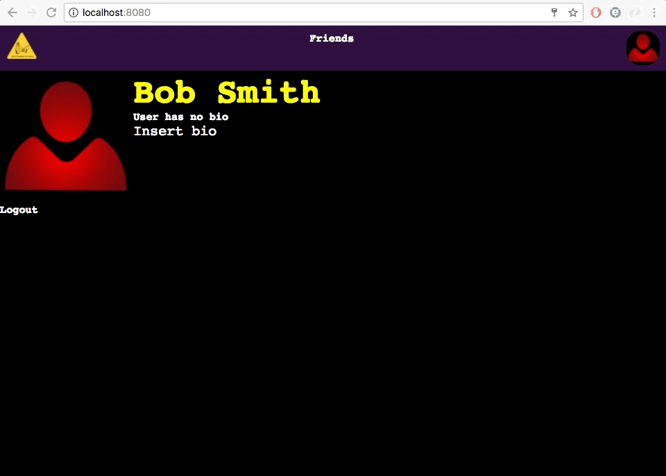

# Social Network Project

## Overview

This full stack project is fun and cheeky take on social networks. Users can add photos, bios, and friends.

## Technology

-- Application built with React and Redux --
 - Developed user-authentication back end.
 - Once logged in, users can view, add, or delete friends and customize their profile.
 - PostgreSQL database.

This application starts off with a standard registration or login form. The information is stored in PostgreSQL with the password being hashed for good security.

Once registered or logged in, the user has the option to upload a profile picture. The images are stored using amazon s3 storage.

The user also has the option to write a short bio about themselves that will be public to all other users. The bio can easily be edited if the user wishes to change anything.

The bread and butter of any social network is having friends. Users can go to other profiles and request friendships. Once requested, the other party can go to their friends page to confirm the friendship. Within the friends page, users can also view all their friends, and delete any friends as well.

